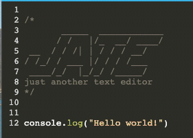

# Text-Editor




## Description 📍
- A browser based text editor featuring data persistence and offline functionality.

## Table Of Contents 📜
* [Installation](#installation)
* [Usage](#usage)
* [Technologies Used](#technologies-used)
* [License](#license)
* [Contribution Guidelines](#contribution-guidelines)
* [Heroku](#heroku)
* [Github Repository](#github-repository)
* [Contact Information](#contact-information)

## Installation 
 1. Run ``` npm i ``` in the terminal to install the required dependencies.
 2. Run ```npm run start``` to invoke the application.

## Usage 
- J.A.T.E is a simple text editor application that can function both online and offline incorporating data persistence techniques in order to ensure that data is not lost in any scenario. 

- The application starts by attempting to use the data provided in indexedDB to populate the editor but transitions to using local storage if indexedDB is unavailable. For use offline use, the application can be downloaded locally to your computer.


## Technologies Used
- HTML
- CSS
- Javascript
- Node.js
- Express.js

## License 
- This project uses the following license:<br>
     - ***MIT***

## Contribution Guidelines 
- All contributors are welcome! Please don't hesitate to contact me below to contribute to this project.

## Heroku 
- [Deployed Heroku Link](https://allec-text-editor.herokuapp.com/)

## Github Repository 
- [Text Editor Repo](https://github.com/axe714/text-editor)

## Contact Information 
- [Github Profile - Axe714](www.github.com/axe714)

- For inquiries/questions, please reach out to me at allecarzadon@gmail.com